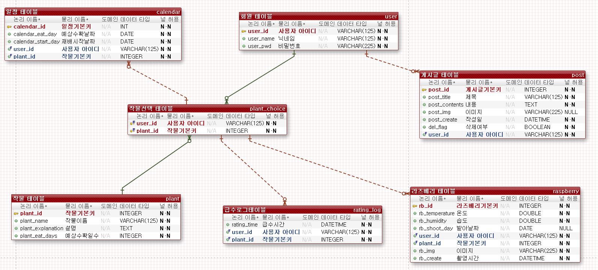

<div align=center></div>

<h2 align=center>서울 A105 - 슬기로운 재배생활 / 농부네 텃밭</h2>

<div align=center>
    
    
    
    
    
    
    
    
</div>

<div align=center>
집 안의 작은 자연, 온 가족 힐링 케어 라이프<br/>
혁신 디바이스를 통해 물만 주면 자동으로 채소 재배 환경 최적화!<br/>
작은 텃밭을 옮겨 놓은 듯한 식물재배기를 통해 <br/>
병충해나 농약이 없이 야채를 안심하고 먹을 수 있습니다. 

</div>


## :book: 목차

### 🌱 [프로젝트 소개](#프로젝트-소개)

### :gear: [프로젝트 설계](#프로젝트 설계)

- ERD
- 시스템 구성도
- 기타 (와이어프레임 / API 문서 / 추천 시스템 소개)

### :package: [프로젝트 구성](#프로젝트 구성)​

* Frontend / Backend 의 사용 Package
* 코드 실행 방법
* IoT 장비 구성품 및 작동 방법

### 🌾 [팀원 소개](#팀원 소개)


## 프로젝트 소개

> **Easy Home gardening**
>
> 집 안 작은 자연으로 당신의 삶에 싱그러운 웰빙 새싹을 선물합니다.
>
> 물만 주면 채소가 자라는 나만의 식탁 농장

씨앗을 심고 새싹을 기다려보세요

물이 훑고 간 자리에서

새싹이 싹트는

식탁 위 작은 농장으로

새로운 삶의 가치를 선사합니다.


## 프로젝트 설계
### ERD

> ERD 설명 추가
>




 

### 시스템 구성도

> 저희는 Spring boot와 flask를 활용한 MSA를 구축했습니다.
>
> Flask로 IoT를 제어하고
>
> 회원 등 웹서버를 Spring boot로 구성하였습니다.


### IoT
> 라즈베리파이를 통해 사용자가 물만 넣으면
>
> 새싹을 자동으로 기를 수 있게 하는 것이 목표입니다.


* [플로우 차트](https://drive.google.com/file/d/1lV2jV9rgNariafkxwM28mbhvYka-KbNf/view?usp=sharing)
    * IoT 플로우 차트
* [새싹채소 만들기 ppt - iot 설명](https://docs.google.com/presentation/d/1bVO_9yoMRVuzXt91g64G9fEk4mUDXefe9HiX2BO0DUQ/edit?usp=sharing)
    * 디바이스 설계 및 설명
* [구매장비 목록](https://docs.google.com/spreadsheets/d/1L0CvwjUjEYeLN4UNH8Oh4hs1I-DfMXOFU8Glkxb1mq0/edit?usp=sharing)
    * 구매장비 목록 문서입니다.    


### 문서

* [프로젝트 계획서](https://docs.google.com/document/d/1hJjWcgzWbUVVBCf-M1eg6aCNJIDI24GV_T3r52wQQDY/edit?usp=sharing)
    * 디바이스 설계 및 설명
* [와이어프레임](https://ovenapp.io/view/aoHmJLeac19v0vBjpbTgWdvtmymmnjOd/zC6EO)
    * kakao oven을 사용하여 제작된 와이어프레임
* [API Documentation](https://docs.google.com/spreadsheets/d/1e9bJdDTk8L3oyalDqiSUmR_t4xPTUf_djbOCobEhkfM/edit?usp=sharing)
    * RESTful 서버의 API 문서입니다.


## 프로젝트 구성

### Frontend 구성 요소

|        Package         |    Version    | Comment                                         |
| :--------------------: | :-----------: | :---------------------------------------------- |
|       vue-cli          |   4.5.4       | vue 개발 환경 설정                              |
|       vue-router       |   3.4.6       | 요청 URL에 따라 브라우저에서 돔을 변경          |
|       vuex             |               | 상태 관리 패턴 + 라이브러리                     |
|       axios            |               | REST API 서버로부터 데이터를 받아오기 위해 사용 |
|       vuetify          |   2.2.11      | UI 구성을 위해 사용                             |
|       cordova          |   2.4.1       | 웹앱 구성을 위해 사용                           |
|       gradle           |   6.7         | 안드로이드 빌드 시스템                          |
|       android-sdk      |   30.0.2      | 안드로이드 소프트웨어 라이브러리 킷             |

### Backend 구성 요소

|   기술 스택    |   Version   | Comment                                    |
| :------------: | :---------: | :----------------------------------------- |
|    OpenJDK     |       | Java vendor 사용                           |
|   SpringBoot   |       | Rest API 웹 애플리케이션 개발              |
|     Maven      |        | 프로젝트를 빌드하고 라이브러리를 관리 도구 |
|     MySQL      |       | DB vendor 사용                             |
|    MyBatis     |      | 서버와 DB의 연동을 위해 사용               |
|     Ubuntu     |  | 서비스 제공을 위해 리눅스 서버 구축        |
|     Docker     |   | 컨테이너화 된 애플리케이션 관리            |
| Docker-Compose |      | 컨테이너 환경 및 실행 관리                 |
|    Jenkins     |      | 자동화 배포 및 빌드                        |
|     Nginx      |      | Vue 클라이언트 웹 서버 사용                |

|      Spring 라이브러리       |  Version   | Comment                              |
| :--------------------------: | :--------: | :----------------------------------- |
|       Spring Security        |     -      | 손쉬운 보안 관리를 위해 사용         |
|           Swagger2           |       | Rest API 스펙 문서화                 |
|             Gson             |     -      | Json - Object 능동 변환을 위해 사용  |
|           Java JWT           |      | 로그인 유저 인증을 위해 토큰 사용    |


## 팀원 소개

### 🌾 A105 슬기로운 재배생활

* **진슬기** - *PM, IoT, backend*- [jinpig2127](https://lab.ssafy.com/jinpig2127)
* **박지은** - *backend* - [wong_303](https://lab.ssafy.com/wong_303)
* **박태록** - *frontend* - [sdf7575](https://lab.ssafy.com/sdf7575)
* **서정하** - *IoT, backend* - [seoroda](https://lab.ssafy.com/seoroda)
* **오지수** - *frontend* - [wltn0213](https://lab.ssafy.com/wltn0213)


### :star: Git Branch 전략

### branch

```bash
(master) -> (develop) -> (develop-front / back) -> (feature/feature명)
```

* master : 배포 가능한 상태로 유지
* develop : 개발용 최상위 branch
* front / back
    * front : Frontend 개발 branch
    * back : Backend 개발 branch
* Fetaure : 기능별 branch
* Hotfix : 급한 버그 수정이 필요한 경우 버그 수정 branch

### commit

```bash
* 지라 이슈와 연동할 때 

    [지라 ID] | [커밋 메세지]
    
    예시]
        S03P31A105-4 | 테스트
        
* 아닐 때는 커밋 메세지만 
```

### merge

```bash
merge 하기 전에 현재 작업 진행 상황 공유
merge 권한은 모두가 가지고 있지만 같은 팀의 다른 사람에게 리뷰 신청 후 merge 하기
merge 후 불필요한 branch 지우기
```


