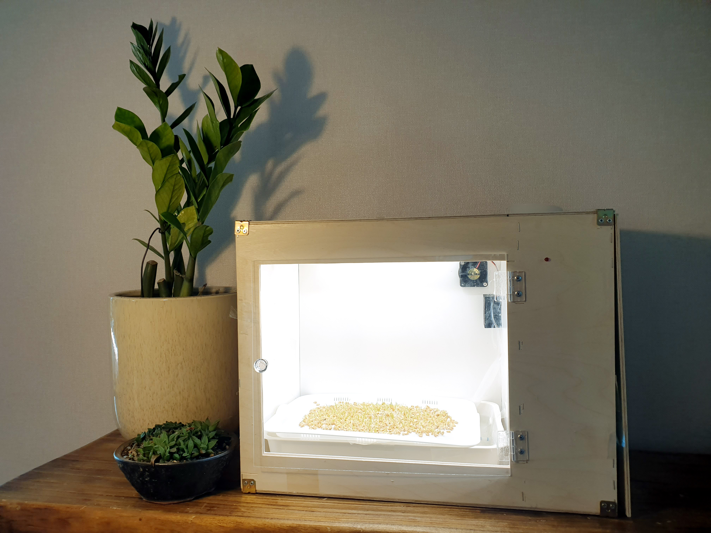
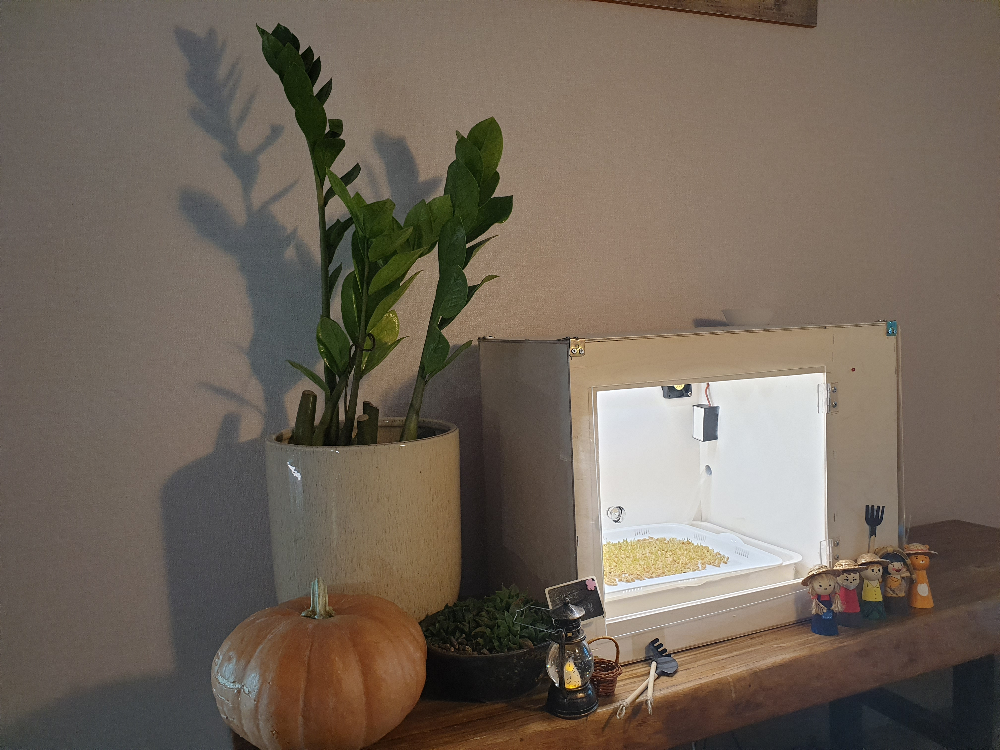
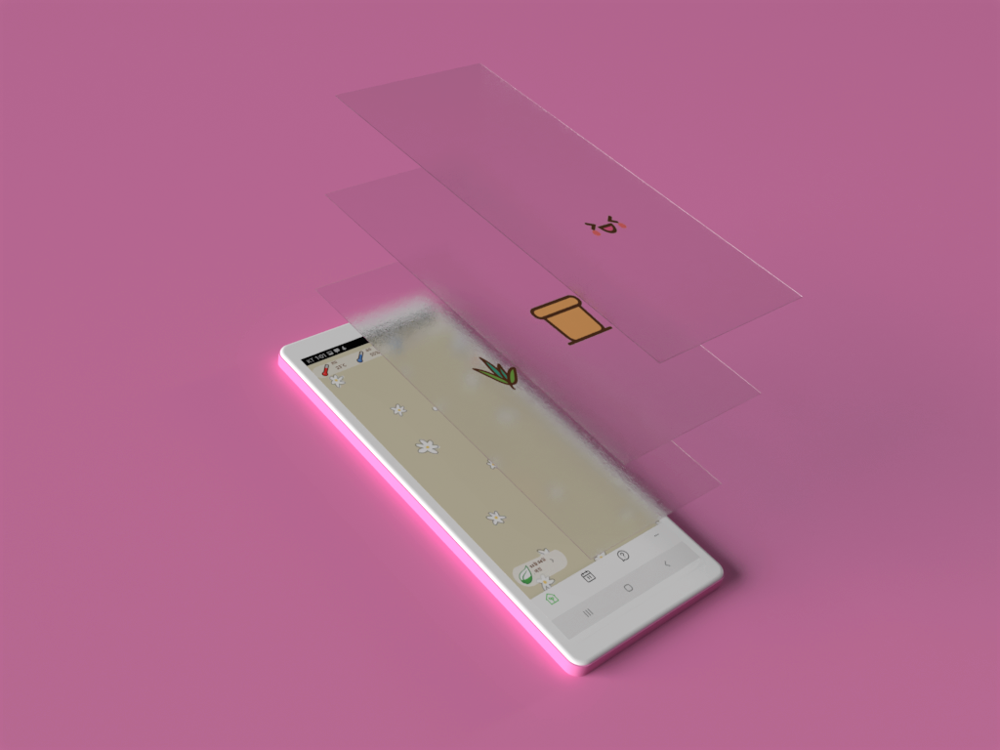
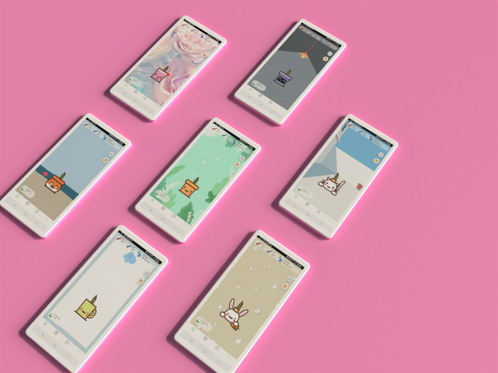
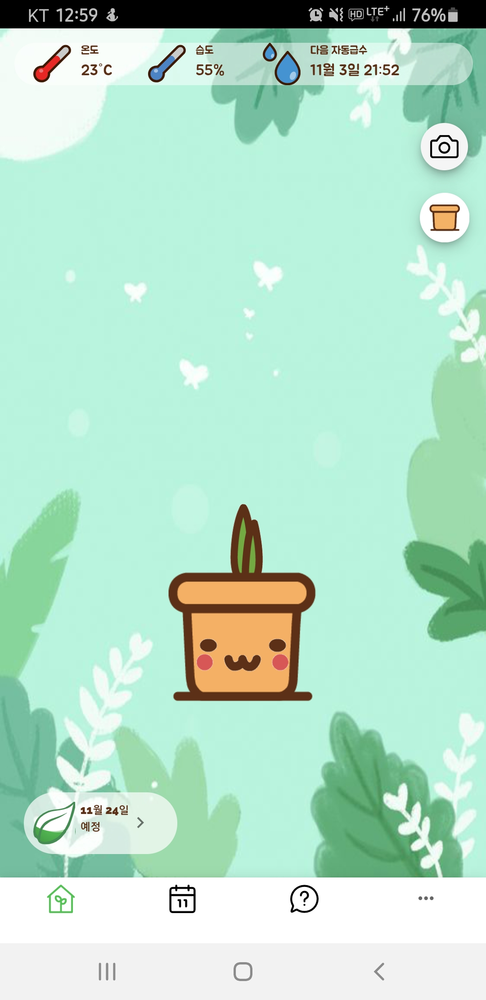
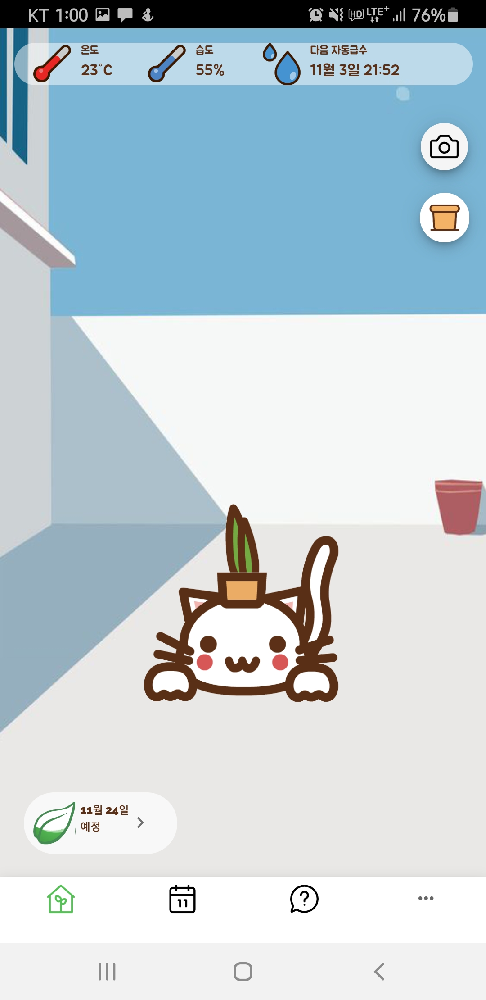

<h1 align=center>농부네텃밭 사진 및 영상</h1>

> 농부네텃밭의 프론트 사진, 영상과
>
> IoT 기능에 따른 사진, 영상을 
>
> 모아놨습니다.

## :book: 목차

### 1. [IoT](#iot)

### 2. [Front](#front)

---

## IoT

### 제품 실제 모습
<table style="table-layout: fixed; overflow-wrap: break-word;">
  <tbody>
    <tr>
      <td style="vertical-align: middle;"></td>
      <td style="vertical-align: middle;"></td>
    </tr>
  </tbody>
</table>

### 기능별 모습
IoT 기기에서 자동 관리 되는 항목은 

1. 스케줄러에 의한 (_사용자가 수동제어 가능_)
    * [식물 생장용 LED](#led-제어)
    * [물 공급 제어](#물-공급)
    * 카메라 모듈로 사진찍기

>   
>   LED: on / off 기능   
>   물: 물펌프를 제어하여 안개분사 노즐로 물 뿌림   
>   카메라: 자동 제어는 1시간 간격으로 설정해서 찍음,     
>           따로 보조 조명이 없어 씨앗 스케줄러에 따라 LED가 꺼져 있을 경우   
>           까맣게 나옵니다.   
>   

2. 센서에 의한 물온도, 습도 자동제어   
    * 수동제어 불가능

>      
>   물온도: 센서가 측정하면 라즈베리파이가 감지하고 수치에 따라 히터를 통해 온도를 올려서 제어함    
>   습도: 습도 센서로 습도를 측정하고 라즈베리파이가 팬을 제어하여 습도를 낮춰서 제어함   
>    

3. 기타
    * 물 부족 알림
    * 수확 알림

####  LED 제어

<table style="table-layout: fixed; overflow-wrap: break-word;">
  <tbody>
    <tr>
      <td width="120" style="vertical-align: middle;"><h6 align=center>장비</h6></td>
      <td width="360">식물 생장용 LED</td>
      <td rowspan=5 style="vertical-align: middle;"></td>
    </tr>
    <tr>
      <td width="120" style="vertical-align: middle;"><h6 align=center>기능</h6></td>
      <td width="360">ON / OFF</td>
    </tr>
    <tr>
      <td width="120" style="vertical-align: middle;"><h6 align=center>제어</h6></td>
      <td width="360">자동 / 수동</td>
    </tr>
    <tr>
      <td width="120" style="vertical-align: middle;"><h6 align=center>인터렉션</h6></td>
      <td width="360">전면부를 아크릴로 설계하여 불빛을 관측할 수 있게 하였습니다</td>
    </tr>
    <tr>
      <td rowspan=2 width="120" style="vertical-align: middle;"><h6 align=center>상세 내용</h6></td>
      <td rowspan=2 width="360">
      
라즈베리 파이에서 씨앗 종류별 스케줄러에 의해 전원 제어를 합니다.

      </td>
    </tr>
  </tbody>
</table>

####  물 공급
<table style="table-layout: fixed; overflow-wrap: break-word;">
  <tbody>
    <tr>
      <td width="120" style="vertical-align: middle;"><h6 align=center>장비</h6></td>
      <td width="360">물통, 필터, 물펌프, 안개분사형 노즐</td>
      <td rowspan=5 style="vertical-align: middle;"></td>
    </tr>
    <tr>
      <td width="120" style="vertical-align: middle;"><h6 align=center>기능</h6></td>
      <td width="360">새싹에 물 공급</td>
    </tr>
    <tr>
      <td width="120" style="vertical-align: middle;"><h6 align=center>제어</h6></td>
      <td width="360">자동 / 수동</td>
    </tr>
    <tr>
      <td width="120" style="vertical-align: middle;"><h6 align=center>인터렉션</h6></td>
      <td width="360">없음</td>
    </tr>
    <tr>
      <td rowspan=2 width="120" style="vertical-align: middle;"><h6 align=center>상세 내용</h6></td>
      <td rowspan=2 width="360">
      
라즈베리 파이에서 씨앗 종류별 스케줄러에 의해 전원 제어를 합니다.

      </td>
    </tr>
  </tbody>
</table>

## Front

### 사이트맵

#### 메인페이지
<table style="table-layout: fixed; overflow-wrap: break-word;">
  <tbody>
    <tr>
      <td width="120" style="vertical-align: middle;"><h6 align=center>주요기능</h6></td>
      <td width="360">가장 최근 관측값 표시(온도, 습도), 다음 급수 시간 알림, 화분 캐릭터 애니메이션</td>
      <td colspan=1 rowspan=2 style="vertical-align: middle;"></td>
    </tr>
    <tr>
      <td width="120" style="vertical-align: middle;"><h6 align=center>상세 내용</h6></td>
      <td width="360">
      
애니메이션 효과를 빠르게 개발하기 위해 캐릭터를 layer로 나누어 각각 gif로 만들었습니다. 
      반복 시간을 다르게 해서 전체 주기를 길게 느껴지게 하여 지루함을 줄이고 생동감을 높였습니다.

      </td>
    </tr>
    <tr>
      <td colspan=2 width="480"></td>
      <td width="480" style="vertical-align: middle;">
      
      
      </td>
    </tr>
  </tbody>
</table>